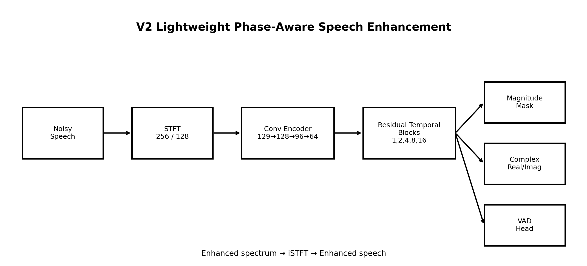
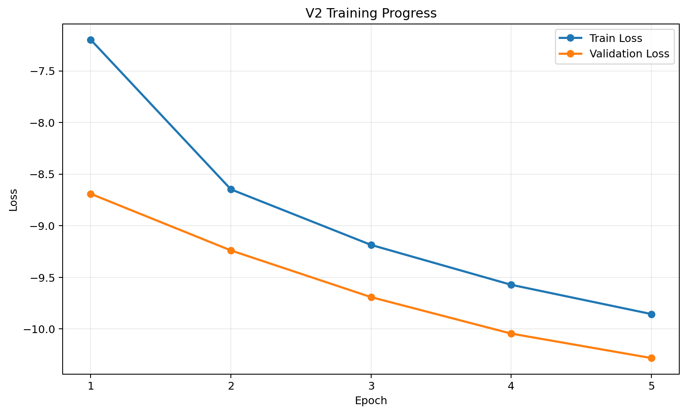
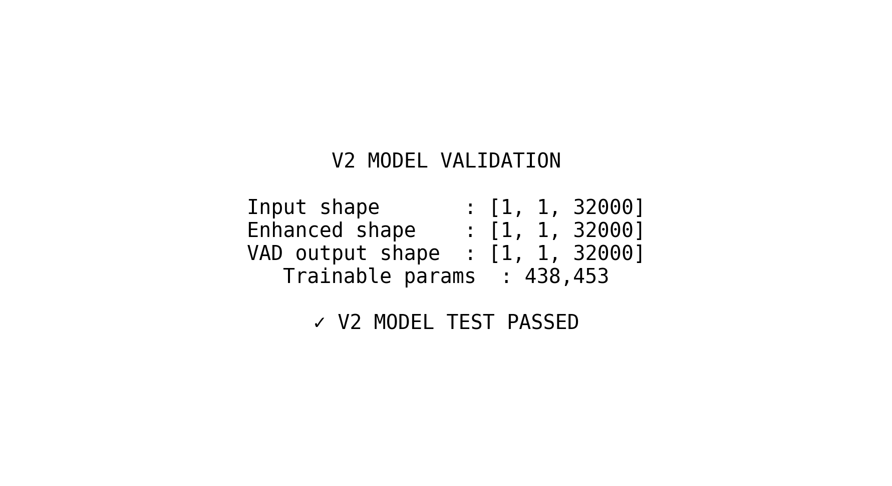
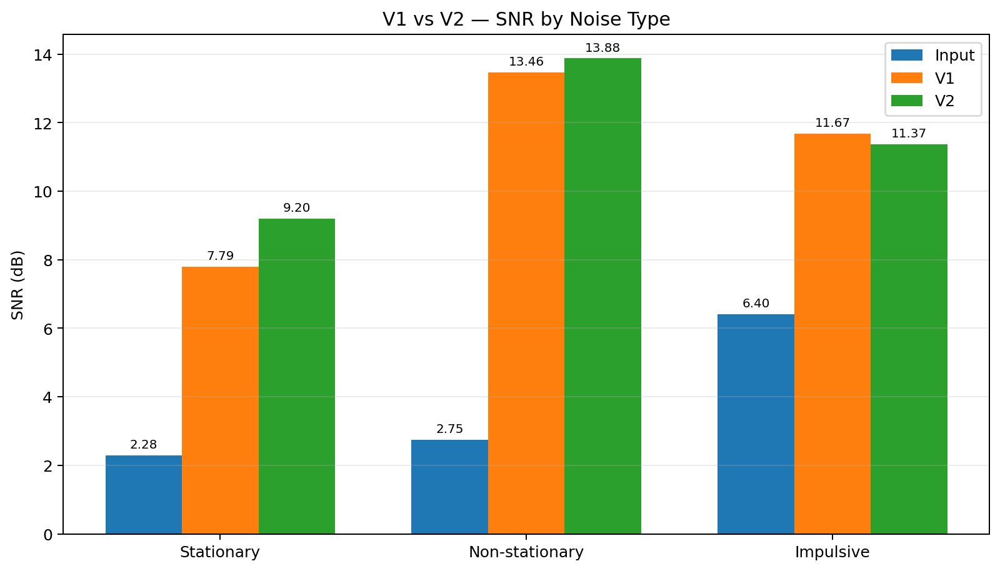
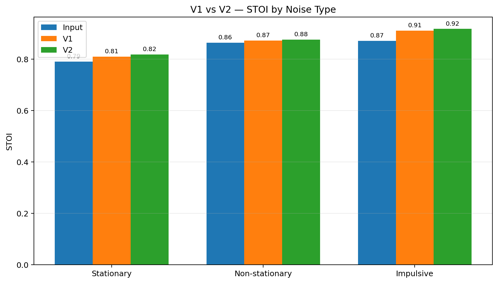
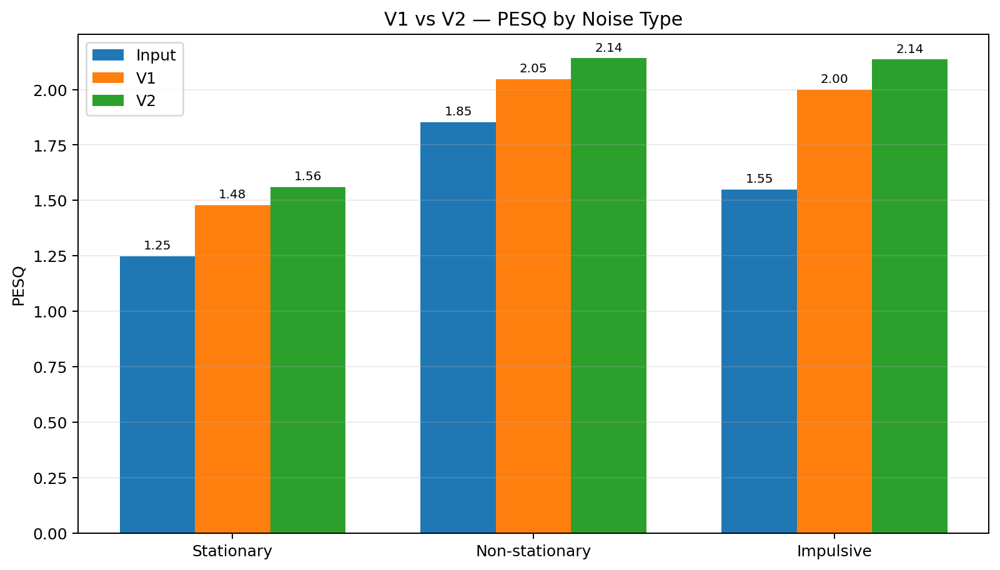
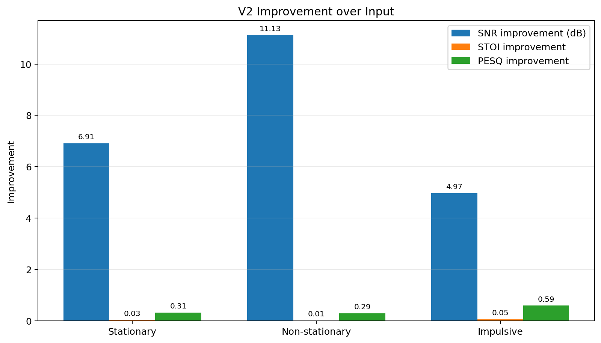
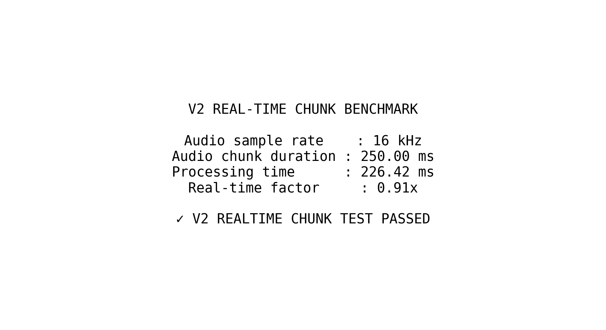

# AI Speech Enhancement V2

  <strong>Lightweight Phase-Aware AI Speech Enhancement for Noisy Communication</strong>

  

  <em>PyTorch-based speech enhancement model designed as the AI front-end for an adaptive noise-cancellation communication pipeline.</em>

---

## 1. Project Overview

This repository contains **V2 of a lightweight AI speech-enhancement system** developed for a defence-communication noise-cancellation project.

The objective is to improve speech intelligibility and perceptual quality when speech is contaminated by different classes of environmental and defence-related noise, while keeping the neural network compact enough for future edge deployment.

The V2 system uses a **phase-aware spectral enhancement architecture** rather than relying only on magnitude masking.

It operates on the Short-Time Fourier Transform (STFT) representation of the noisy waveform and predicts:

- Magnitude mask
- Real-valued spectral correction
- Imaginary-valued spectral correction
- Voice-activity estimate (VAD)

---

## 2. Motivation

Communication systems operating in noisy environments can suffer from:

- Stationary background noise
- Non-stationary noise
- Impulsive noise
- Reduced speech intelligibility
- Speech distortion caused by aggressive noise suppression

The goal of this project is to balance:

**Noise reduction + Speech preservation + Perceptual quality + Computational efficiency**

The V2 model forms the AI speech-enhancement stage of the broader system:

**Microphone → Noisy Speech → STFT / Spectral Representation → AI Speech Enhancement V2 → Enhanced Speech**

The V2 model produces four outputs:

- **Magnitude Mask**
- **Real Spectral Correction**
- **Imaginary Spectral Correction**
- **Voice Activity Detection (VAD)**

---

## 3. Key Features

| Feature | V2 Implementation |
|---|---|
| Input | Noisy speech waveform |
| Sample rate | 16 kHz |
| STFT FFT size | 256 |
| Hop length | 128 |
| Window length | 256 |
| Spectral bins | 129 |
| Temporal processing | Dilated residual blocks |
| Spectral correction | Real + imaginary |
| Speech protection | VAD branch |
| Parameters | **438,453** |
| Framework | PyTorch |
| Evaluation | SNR, STOI, PESQ |
| Noise categories | Stationary, non-stationary, impulsive |
| Segment length | 32,000 samples |
| Chunk benchmark | 226.42 ms / 250 ms audio |

---

## 4. V2 Model Architecture

The V2 network is a lightweight phase-aware spectral enhancement model.

### Processing Pipeline

Noisy Waveform
      |
      v
     STFT
      |
      v
Spectral Features
      |
      v
Conv Encoder
129 -> 128 -> 96 -> 64
      |
      v
Residual Temporal Blocks
1 -> 2 -> 4 -> 8 -> 16
      |
      +----------------+----------------+-------------+
      |                |                |             |
      v                v                v             v
Magnitude Mask   Real Correction  Imag Correction   VAD
      |                |                |
      +----------------+----------------+
                       |
                       v
             Corrected Complex Spectrum
                       |
                       v
                     iSTFT
                       |
                       v
                Enhanced Speech

  

### Main Components

- STFT-based spectral processing
- Convolutional feature encoder
- Dilated residual temporal blocks
- Magnitude-mask prediction
- Real-valued spectral correction
- Imaginary-valued spectral correction
- Voice-activity estimation
- Complex-spectrum reconstruction
- Inverse STFT waveform reconstruction

---

## 5. Phase-Aware Enhancement

A conventional spectral-mask model mainly modifies the magnitude of the noisy spectrum.

V2 additionally predicts **real and imaginary spectral corrections**.

**Noisy Complex Spectrum → Magnitude Information + Real Component Correction + Imaginary Component Correction → Corrected Complex Spectrum → Enhanced Speech**

Unlike a magnitude-only enhancement model, V2 also learns real and imaginary spectral corrections to improve the reconstructed speech signal.

---

## 6. Dataset and Noise Conditions

The project uses noisy-clean paired speech data from:

- **LibriSpeech train-clean-100** — clean speech
- **MUSAN** — noise material
- **DEMAND** — environmental noise
- **ESC-50** — environmental and impulsive sound categories

The main noise classes are:

- **Stationary:** relatively stable background noise
- **Non-stationary:** noise characteristics change with time
- **Impulsive:** short-duration, high-energy disturbances

---

## 7. Training Strategy

The model is trained using paired noisy and clean speech.

The V2 objective combines:

- SI-SNR loss
- Multi-resolution STFT loss
- Waveform L1 loss
- Energy loss
- VAD loss

### Training Configuration

| Parameter | Value |
|---|---:|
| Training samples | 6000 |
| Validation samples | 800 |
| Batch size | 8 |
| Epochs | 5 |
| Learning rate | 1e-3 |
| Gradient clipping | 5 |
| Segment length | 32,000 samples |
| Sample rate | 16 kHz |

---

## 8. Training Progress

| Epoch | Train Loss | Validation Loss |
|---:|---:|---:|
| 1 | -7.197984 | -8.691446 |
| 2 | -8.647911 | -9.239872 |
| 3 | -9.186437 | -9.692357 |
| 4 | -9.572844 | -10.045975 |
| 5 | **-9.856502** | **-10.283008** |

---

## 9. Model Validation

The complete model forward path was tested using a 32,000-sample waveform.
Input shape       : [1, 1, 32000]
Enhanced shape    : [1, 1, 32000]
VAD output shape  : [1, 1, 32000]
Trainable params  : 438,453

V2 MODEL TEST PASSED

---

## 10. V1 vs V2 Evaluation

The V2 model was evaluated against the previous V1 model using stationary, non-stationary, and impulsive noise conditions.

| Noise Type | Input SNR | V1 SNR | V2 SNR | V1 STOI | V2 STOI | V1 PESQ | V2 PESQ |
|---|---:|---:|---:|---:|---:|---:|---:|
| Stationary | 2.284 | 7.794 | **9.198** | 0.8095 | **0.8182** | 1.4791 | **1.5608** |
| Non-stationary | 2.750 | 13.462 | **13.878** | 0.8723 | **0.8760** | 2.0461 | **2.1409** |
| Impulsive | 6.402 | **11.674** | 11.371 | 0.9109 | **0.9174** | 2.0001 | **2.1353** |

### SNR Comparison

### STOI Comparison

### PESQ Comparison

### Improvement Summary

---

## 11. Final V2 Evaluation

The final V2 model was evaluated on the test set using SNR, STOI, and PESQ.

| Metric | Input | V2 Output |
|---|---:|---:|
| SNR | 3.40 dB | **10.92 dB** |
| SNR Improvement | — | **+7.52 dB** |
| STOI | 0.841 | **0.869** |
| PESQ | 1.519 | **1.934** |

### Project Targets

| Metric | Target | Current V2 |
|---|---:|---:|
| SNR | >15 dB | ~10.92 dB |
| STOI | >0.85 | ~0.869 |
| PESQ | >2.5 | ~1.934 |

The current V2 implementation demonstrates measurable speech enhancement and improves speech intelligibility, but the current model does not yet achieve all project targets.

---

## 12. Real-Time Processing Benchmark

The V2 model was tested using a 250 ms audio chunk.

| Parameter | Result |
|---|---:|
| Audio chunk duration | 250 ms |
| Processing time | 226.42 ms |
| Real-Time Factor | 0.91× |
| Sample rate | 16 kHz |

The benchmark shows that the current model can process a 250 ms chunk in approximately 226 ms on the development system. Further optimization is required for a larger real-time latency margin.

---

## 15. Software and Tools

### Programming and AI

- Python
- PyTorch
- NumPy
- SciPy
- Librosa
- SoundFile
- PESQ
- STOI

### Hardware / FPGA Development

The overall project is intended for edge deployment using FPGA/SoC platforms such as Zynq-based systems.

Potential hardware implementation blocks include:

- FIR filtering
- FFT/STFT processing
- AI inference
- System control

---

## 16. Repository Structure

AI-Speech-Enhancement-V2/
│
├── model_V2.py
├── losses_V2.py
├── train_V2.py
├── train_V2_AUG.py
├── evaluate_V2_FINAL.py
│
├── realtime_server.py
│
├── checkpoints/
│   ├── FINAL_MODEL_V2.pt
│   └── FINAL_MODEL_V2_BEFORE_UPGRADE.pt
│
├── screenshots/
│   ├── 01_snr_v1_vs_v2.png
│   ├── 02_stoi_v1_vs_v2.png
│   ├── 03_pesq_v1_vs_v2.png
│   ├── 04_v2_improvement_summary.png
│   ├── 05_v2_architecture.png
│   ├── 06_v2_training_progress.png
│   ├── 07_v2_model_test.png
│   └── 08_v2_realtime_benchmark.png
│
├── V2_RESULTS.md
└── README.md

---

## 17. Current Limitations

The current implementation is a research prototype and has several areas that require further development:

1. The current SNR result is below the project target of 15 dB.
2. PESQ is currently below the target value of 2.5.
3. The real-time benchmark has limited latency margin.
4. The current live microphone setup does not provide a clean reference signal, so objective SNR/STOI/PESQ measurements require paired noisy-clean evaluation data.
6. FPGA/SoC deployment and hardware acceleration are future integration stages.

These limitations are documented so that the current results are not overstated.

---

## 18. Future Development

Planned improvements include:

- Stronger speech-preservation loss functions
- Perceptual loss optimization
- More aggressive noise augmentation
- Reverberation augmentation
- Clipping and microphone distortion augmentation
- Improved stationary-noise suppression
- Improved impulsive-noise handling
- Primary/reference microphone integration
- Secondary-path identification
- Model quantization
- Model pruning
- ONNX-based deployment
- FPGA/SoC acceleration
- End-to-end hardware validation

---

## 19. Project Status

### Completed

- [x] Noisy-clean speech dataset preparation
- [x] Stationary noise handling
- [x] Non-stationary noise handling
- [x] Impulsive noise handling
- [x] V2 phase-aware enhancement model
- [x] Multi-component training loss
- [x] V1 vs V2 comparison
- [x] SNR evaluation
- [x] STOI evaluation
- [x] PESQ evaluation
- [x] Real-time processing benchmark
- [x] GitHub documentation

### In Progress

- [ ] Further V2 performance optimization
- [ ] Improved perceptual quality
- [ ] FPGA/SoC deployment

---

## 20. Results at a Glance

| Area | Current Status |
|---|---|
| AI Speech Enhancement | Implemented |
| Phase-aware Processing | Implemented |
| Stationary Noise | Evaluated |
| Non-stationary Noise | Evaluated |
| Impulsive Noise | Evaluated |
| SNR Improvement | Demonstrated |
| STOI Improvement | Demonstrated |
| PESQ Improvement | Demonstrated |
| Real-Time Benchmark | Completed |
| FPGA Deployment | Future stage |

---

## 21. Conclusion

AI Speech Enhancement V2 provides a lightweight phase-aware neural speech-enhancement system for noisy communication environments.

The model combines spectral magnitude estimation with real and imaginary spectral corrections, allowing both magnitude and phase information to be refined during enhancement.

Experimental evaluation shows measurable improvements in **SNR, STOI, and PESQ** compared with the previous V1 model.

The current V2 implementation provides a strong foundation for further improvement in speech quality, noise suppression, computational efficiency, and real-time processing.

## 22. Acknowledgement

This project was developed as part of **Smart India Hackathon 2026**.

We would like to thank our faculty members, mentors, and teammates for their guidance, support, and encouragement during the development and testing of the AI Speech Enhancement V2 system.

---

## 23. License

This project is intended for educational, research, and academic purposes.

Please refer to the repository and project documentation for details about the included source code, model, results, and supporting materials.
